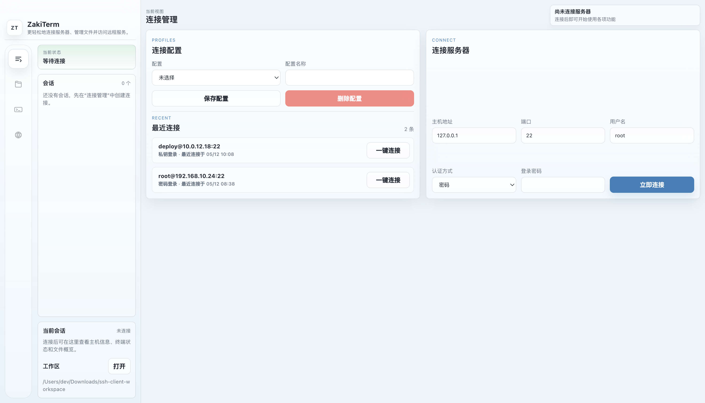

# ZakiTerm

ZakiTerm 是一个面向 macOS 的开源桌面 SSH 客户端，基于 Electron、React 和 TypeScript 构建。它把 SSH 终端、SFTP 文件传输、连接配置管理和远程 Web 隧道访问放在同一个桌面应用里，适合日常服务器运维、远程开发和 Electron 桌面应用学习。



## 适合谁使用

- 需要一个轻量 SSH 桌面客户端的开发者
- 希望在一个窗口里完成终端、文件传输和远程服务访问的人
- 想学习 Electron 主进程、预加载层、React 渲染层如何分工的开发者
- 想参考 macOS 桌面应用打包、图标生成和 npm CLI 分发流程的维护者

## 核心能力

- SSH 终端：基于 `xterm` 提供交互式 Shell
- 多会话管理：支持多个 SSH 会话并行切换
- 连接配置：支持保存常用主机、认证方式和最近连接
- SFTP 文件管理：浏览远程目录，上传和下载文件
- 远程浏览器：通过 SSH 隧道打开远端 Web 服务
- macOS 打包：支持生成 `.dmg` 和 `.zip` 安装包
- CLI 启动：支持通过 npm 全局安装后使用 `zakiterm` 启动应用

## 技术栈

- Electron
- React 18
- TypeScript
- electron-vite
- ssh2
- xterm
- electron-builder

## 快速开始

环境要求：

- macOS
- Node.js 18+
- npm 9+

安装依赖：

```bash
npm install
```

启动开发环境：

```bash
npm run dev
```

类型检查：

```bash
npm run typecheck
```

构建产物：

```bash
npm run build
```

## 安装使用

从源码本地启动：

```bash
npm install
npm run dev
```

构建 macOS 安装包：

```bash
npm run dist:dmg
```

构建完成后，安装包会输出到 `dist/` 目录。

如果项目已经发布到 npm，也可以全局安装后启动：

```bash
npm install -g zakiterm
zakiterm
```

## 项目结构

```text
src/
  main/         Electron 主进程：SSH、SFTP、端口转发、窗口管理、IPC
  preload/      预加载层：通过 contextBridge 暴露受控 API
  renderer/     React 渲染层：页面、状态和用户交互
  shared/       主进程与渲染进程共享类型
assets/
  icon.svg              图标源文件
  ZakiTerm.icns         macOS 应用图标
  zakiterm-home.png     README 首页截图
bin/
  zakiterm.mjs          npm 全局安装后的启动入口
scripts/
  build-icon.mjs        生成 macOS 图标资源
  ensure-electron.mjs   npm 安装后补充 Electron 运行时
out/
  Electron / Vite 构建输出
dist/
  electron-builder 生成的安装包
```

## 架构说明

ZakiTerm 采用典型 Electron 分层：

- 主进程负责系统能力，包括 SSH 连接、Shell 通道、SFTP、文件选择、下载目录、SSH 隧道和窗口生命周期
- 预加载层通过 `contextBridge` 暴露 `window.sshApi`，限制渲染层直接访问 Node 能力
- 渲染层只负责界面状态、用户交互、会话切换、终端展示和文件树展示
- 共享类型集中在 `src/shared`，减少 IPC 调用两侧的类型漂移

这个分层能让高权限能力收敛在主进程，渲染层保持相对简单，也方便后续接入更严格的权限控制和安全存储。

## 常用命令

```bash
npm run dev          # 启动开发环境
npm run typecheck    # TypeScript 类型检查
npm run build        # 构建 Electron / Vite 产物
npm run build:icon   # 生成 macOS 图标
npm run dist:dmg     # 构建 dmg 安装包
npm run dist:mac     # 构建 dmg 和 zip
```

## 数据与安全

应用会在 Electron `userData` 目录下保存本地数据：

- `connection-profiles.json`
- `recent-connections.json`
- `recent-browser-visits.json`

当前版本仍处于早期阶段，需要注意：

- 密码和私钥口令尚未接入系统 Keychain
- 应用未做 Apple Developer 签名和 notarization
- 暂未内置自动更新
- 生产环境使用前建议先评估本地凭据存储策略

## 贡献指南

欢迎围绕以下方向提交 Issue 或 Pull Request：

- 接入 macOS Keychain，避免明文保存敏感信息
- 增强多会话、标签页和连接分组体验
- 改进 SFTP 文件操作能力
- 增加远程监控、端口转发和服务探测能力
- 补充自动化测试、CI 构建和 Release 流程
- 完善签名、公证和自动更新链路

提交改动前建议至少运行：

```bash
npm run typecheck
npm run build
```

## 路线图

- 系统安全存储：接入 Keychain
- 发布工程化：GitHub Actions 自动打包和发布
- 应用更新：增加自动更新能力
- 会话体验：连接收藏、分组、标签页增强
- 文件能力：批量上传、下载队列、冲突处理
- 远程能力：更多 SSH 隧道与远程服务调试场景
